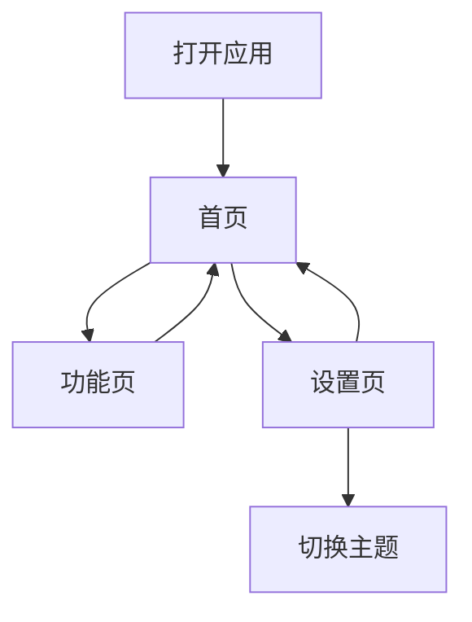

## 1. Product Overview
移动端响应式 Web 应用，提供简洁美观的用户界面，适配各种移动设备。
- 为移动用户提供优化的浏览体验，解决桌面端网页在移动端显示不佳的问题
- 目标用户为移动设备用户，提供直观易用的界面和流畅的交互体验

## 2. Core Features

### 2.1 User Roles (if applicable)
| Role | Registration Method | Core Permissions |
|------|---------------------|------------------|
| Normal User | No registration | Browse all features |

### 2.2 Feature Module
1. **首页**：英雄区域、卡片列表、底部导航
2. **功能页**：功能展示、交互元素
3. **设置页**：主题切换、应用信息

### 2.3 Page Details
| Page Name | Module Name | Feature description |
|-----------|-------------|---------------------|
| 首页 | 英雄区域 | 渐变色背景、标题、副标题、CTA按钮 |
| 首页 | 卡片列表 | 可滚动卡片、图标、标题、描述 |
| 首页 | 底部导航 | 导航图标、点击切换页面 |
| 功能页 | 功能展示 | 网格布局、功能卡片、交互反馈 |
| 功能页 | 交互元素 | 按钮、开关、滑动条 |
| 设置页 | 主题切换 | 亮色/深色模式切换 |
| 设置页 | 应用信息 | 版本号、关于信息 |

## 3. Core Process
用户打开应用后，首先看到首页，可以通过底部导航在不同页面之间切换。在功能页可以与各种交互元素互动，在设置页可以切换主题。

## 4. User Interface Design
### 4.1 Design Style
- 主色调：蓝色系 (#3B82F6)，辅助色：紫色系 (#8B5CF6)
- 按钮风格：圆角按钮、悬浮效果、点击反馈
- 字体：Noto Sans SC 中文字体，无衬线西文字体
- 布局风格：卡片式布局、底部导航、全屏沉浸式
- 图标/emoji：使用 lucide-react 图标库，风格统一简洁

### 4.2 Page Design Overview
| Page Name | Module Name | UI Elements |
|-----------|-------------|-------------|
| 首页 | 英雄区域 | 渐变色背景、大标题、圆润按钮、上下留白 |
| 首页 | 卡片列表 | 水平滚动卡片、圆角边框、阴影效果 |
| 首页 | 底部导航 | 图标+文字、选中状态高亮、固定在底部 |
| 功能页 | 功能展示 | 两列网格、卡片悬停效果、图标动画 |
| 功能页 | 交互元素 | 流畅动画、状态反馈、触摸优化 |
| 设置页 | 主题切换 | 开关控件、平滑过渡、保存状态 |
| 设置页 | 应用信息 | 简洁列表、清晰层次 |

### 4.3 Responsiveness
- 移动优先设计，适配 320px 到 768px 屏幕宽度
- 触摸优化：按钮最小 44x44px，足够的点击区域
- 响应式布局：网格和弹性布局自适应不同屏幕

### 4.4 3D Scene Guidance (if applicable)
不适用 3D 场景
